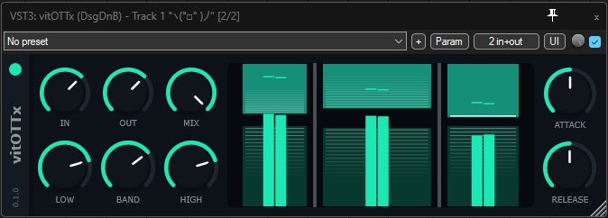

# vitOTTx

A cross-platform multiband compressor audio plugin (VST3 / AU / LV2).

## Building (Windows)

1. `init.bat` — initializes the JUCE submodule and copies `config.bat.example` → `config.bat`.
2. Edit `config.bat` — point the variables at your local Visual Studio Build Tools / CMake / Ninja.
3. `build.bat` (Debug) or `build.bat Release`.

Artifacts land in `build\vitOTTx_artefacts\<Config>\`.

## Building (macOS)

1. `./init.sh` — installs CMake/Ninja via Homebrew and initializes the JUCE submodule.
2. `./build.sh` (Debug) or `./build.sh Release`.
3. `./build-xcode.sh` — generate & open an Xcode project if you prefer debugging there.

## Building (Linux)

1. Install `cmake`, `ninja-build` and a C++17 toolchain via your package manager.
2. `./build.sh` (Debug) or `./build.sh Release` — submodules are initialized automatically (shallow clone).

## License

The entire source is licensed under the GPLv3 (see `LICENSE`). If you distribute the source or built binaries, you must comply with that license.

## Acknowledgements
- [Vital](https://github.com/mtytel/vital) — Matt Tytel's synth, source of the original OTT compressor DSP
- [vitOTT](https://github.com/edgjj/vitOTT) — Yegor Suslin's fork that this project is based on
- [JUCE](https://github.com/juce-framework/JUCE) — audio plugin framework

## Support

If you find this useful, consider [supporting the developer](https://dsgdnb.com/donate).
